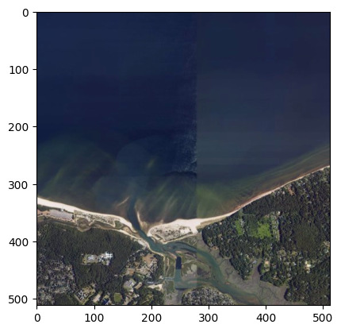

# async-tiff

[![PyPI][pypi_badge]][pypi_link]

[pypi_badge]: https://badge.fury.io/py/async-tiff.svg
[pypi_link]: https://pypi.org/project/async-tiff/

Fast, low-level async TIFF and GeoTIFF reader for Python.

This documentation is for the Python bindings. [Refer here for the Rust crate documentation](https://docs.rs/async-tiff).

## Examples

### Reading NAIP

```py
from async_tiff import TIFF
from async_tiff.store import S3Store

# You'll also need to provide credentials to access a requester pays bucket
store = S3Store("naip-visualization", region="us-west-2", request_payer=True)
path = "ny/2022/60cm/rgb/40073/m_4007307_sw_18_060_20220803.tif"

tiff = await TIFF.open_async(path, store=store)
primary_ifd = tiff.ifds[0]

primary_ifd.geo_key_directory.citation
# 'NAD83 / UTM zone 18N'

primary_ifd.geo_key_directory.projected_type
# 26918
# (EPSG code)

primary_ifd.sample_format
# [<SampleFormat.Uint: 1>, <SampleFormat.Uint: 1>, <SampleFormat.Uint: 1>]

primary_ifd.bits_per_sample
# [8, 8, 8]

tile = await tiff.fetch_tile(0, 0, 4)
array = await tile.decode_async()

# Use rasterio and matplotlib for visualization
import numpy as np
from rasterio.plot import reshape_as_raster, show

# Zero-copy conversion of the rust array into a numpy array
np_array = np.asarray(array)

# Then we need to reshape the "image" axes into "raster" axes
# https://rasterio.readthedocs.io/en/stable/topics/image_processing.html
show(reshape_as_raster(np_array), adjust=True)
```




### Reading Sentinel 2 L2A

```py
import numpy as np
from async_tiff import TIFF
from async_tiff.store import S3Store

store = S3Store("sentinel-cogs", region="us-west-2", skip_signature=True)
path = "sentinel-s2-l2a-cogs/12/S/UF/2022/6/S2B_12SUF_20220609_0_L2A/B04.tif"

tiff = await TIFF.open_async(path, store=store)
primary_ifd = tiff.ifds[0]
# Text readable citation
primary_ifd.geo_key_directory.citation
# EPSG code
primary_ifd.geo_key_directory.projected_type

primary_ifd.sample_format[0]
# <SampleFormat.Uint: 1>
primary_ifd.bits_per_sample[0]
# 16

tile = await tiff.fetch_tile(0, 0, 0)
array = await tile.decode_async()

# Zero-copy conversion of the rust array into a numpy array
np_array = np.asarray(array)
np_array.shape
# (1024, 1024, 1)
```

